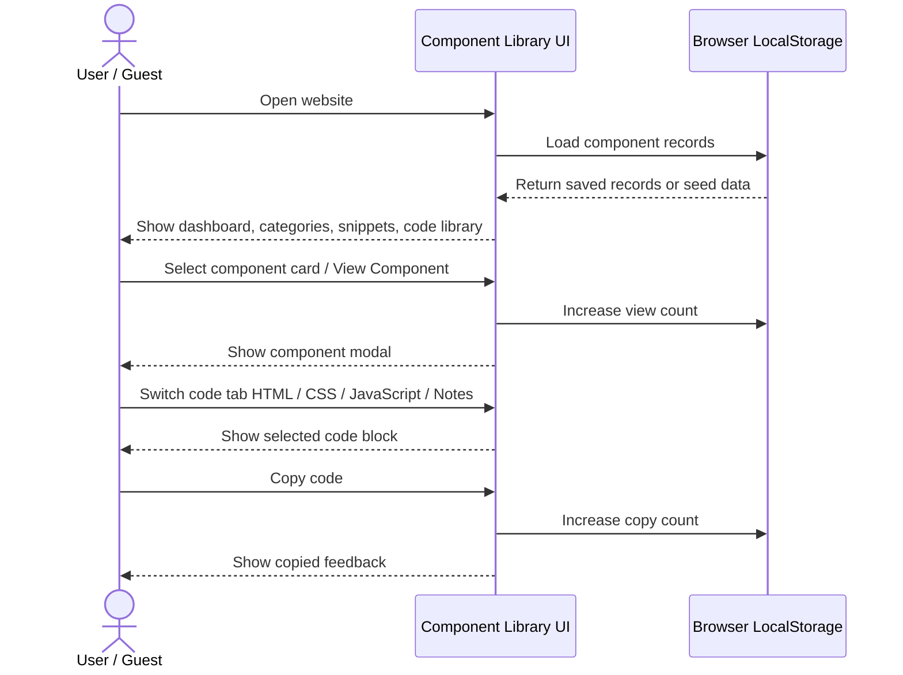
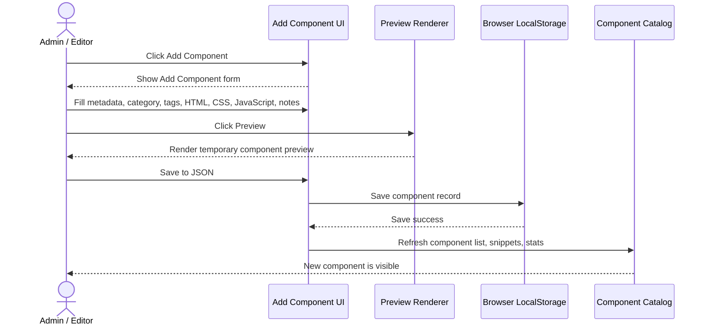
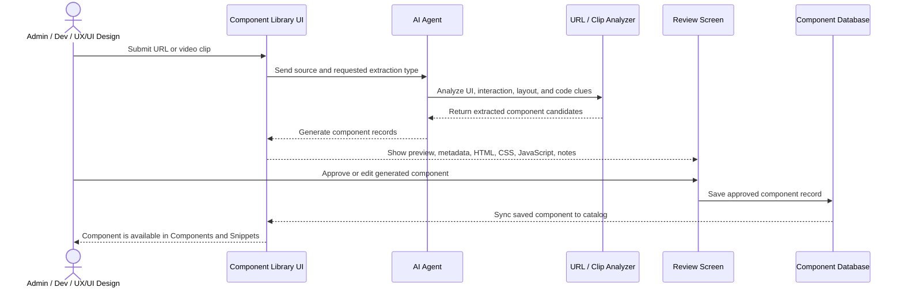
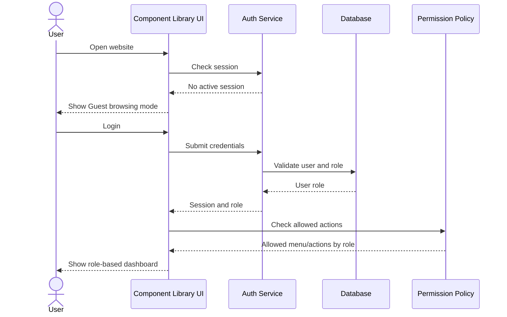
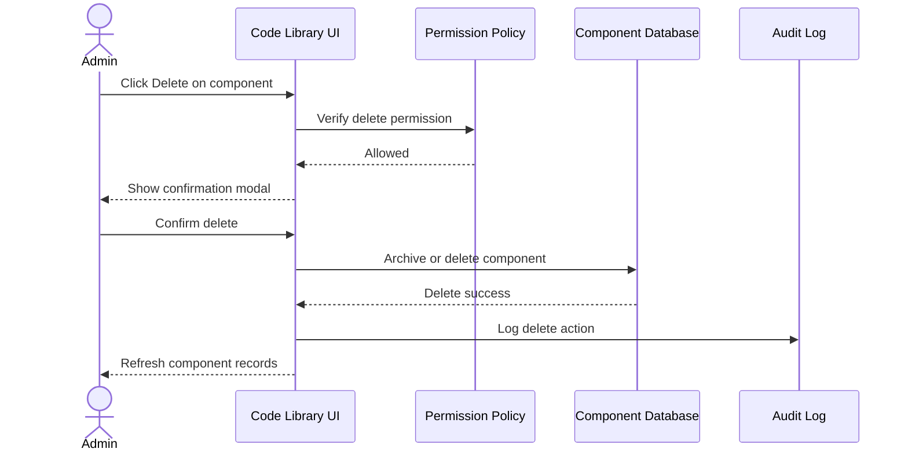
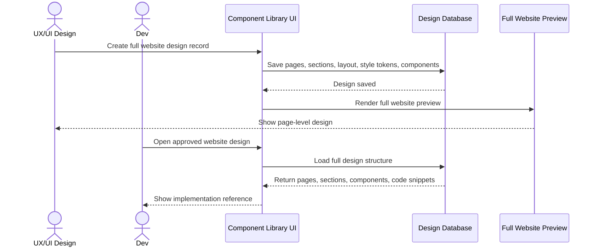
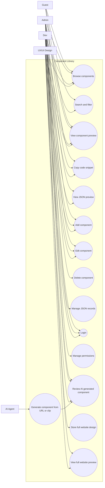
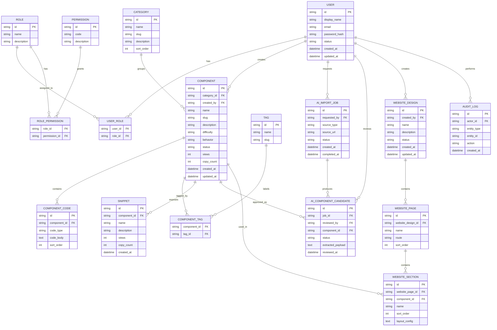

# Component Library - Design Diagrams

เอกสารนี้เป็น design diagram เท่านั้น ยังไม่ใช่ implementation plan และยังไม่เริ่มทำ feature ใหม่

Base project: `Component Library` web สำหรับเก็บ reusable UI components, snippets, preview และ code ตัวอย่าง

Future feature base: `FUTURE_FEATURES.md`

## 1. Current V1 Flow - View And Copy Component

## 2. Current V1 Flow - Add Component As JSON-Style Data

## 3. Future Flow - Add Component By AI Agent From URL Or Clip

## 4. Future Flow - Login And Permission

## 5. Future Flow - Delete Component

## 6. Future Flow - Full Website Design Support

## 7. Use Case Diagram

## 8. ER Diagram - Database Option

ใช้ในกรณี future version เปลี่ยนจาก browser localStorage / static JSON ไปเป็น database

## 9. Database Notes

- `COMPONENT` คือ master record ของ component
- `COMPONENT_CODE` แยก HTML, CSS, JavaScript, Notes หรือ code type อื่นในอนาคต
- `SNIPPET` ใช้สำหรับ compact snippet view และ popular snippets
- `AI_IMPORT_JOB` เก็บงานที่มาจาก AI agent เช่น URL หรือ clip
- `AI_COMPONENT_CANDIDATE` เก็บผลที่ AI extract มาให้ user review ก่อน save จริง
- `WEBSITE_DESIGN`, `WEBSITE_PAGE`, `WEBSITE_SECTION` รองรับ future feature: full website design
- `ROLE`, `PERMISSION`, `USER_ROLE`, `ROLE_PERMISSION` รองรับ Admin, Guest, Dev, UX/UI Design
- `AUDIT_LOG` ใช้เก็บประวัติ action สำคัญ เช่น add, edit, delete, approve AI candidate
